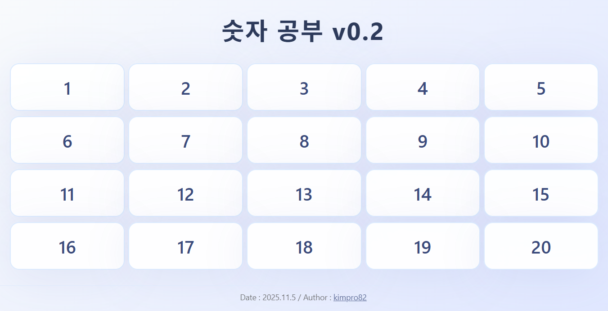
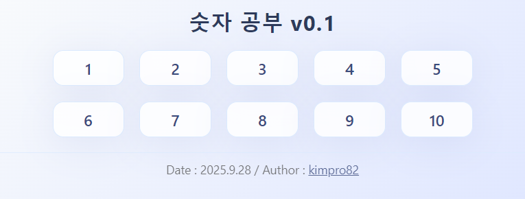

# [Number Learning](/README.md#number-learning)

For my son

### \<List>

- [Number Learning v0.2 (2025.11.05)](#number-learning-v02-20251105)
- [Number Learning v0.1 (2025.09.28)](#number-learning-v01-20250928)

## [Number Learning v0.2 (2025.11.05)](#list)

- Partial feature updates and bug fixes from v0.1

  

- Completed tasks
  - Expanded the number range from 1–10 to 1–20  
  - Adjusted the audio to play only once per touch

- Future improvements
  - Add a number range selection feature  
  - Introduce game elements, e.g., a quiz mode (listen to the pronunciation and guess the number)  
  - Add visual representations of numbers  
  - Add a background image

## [Number Learning v0.1 (2025.09.28)](#list)

- A web page for my son to learn numbers

  

- Tasks
  - Tapping a number plays its sound.
  - Touching a cell triggers a visual effect.

- Future improvements
  - The app includes not only numbers but also images that show the quantities.
